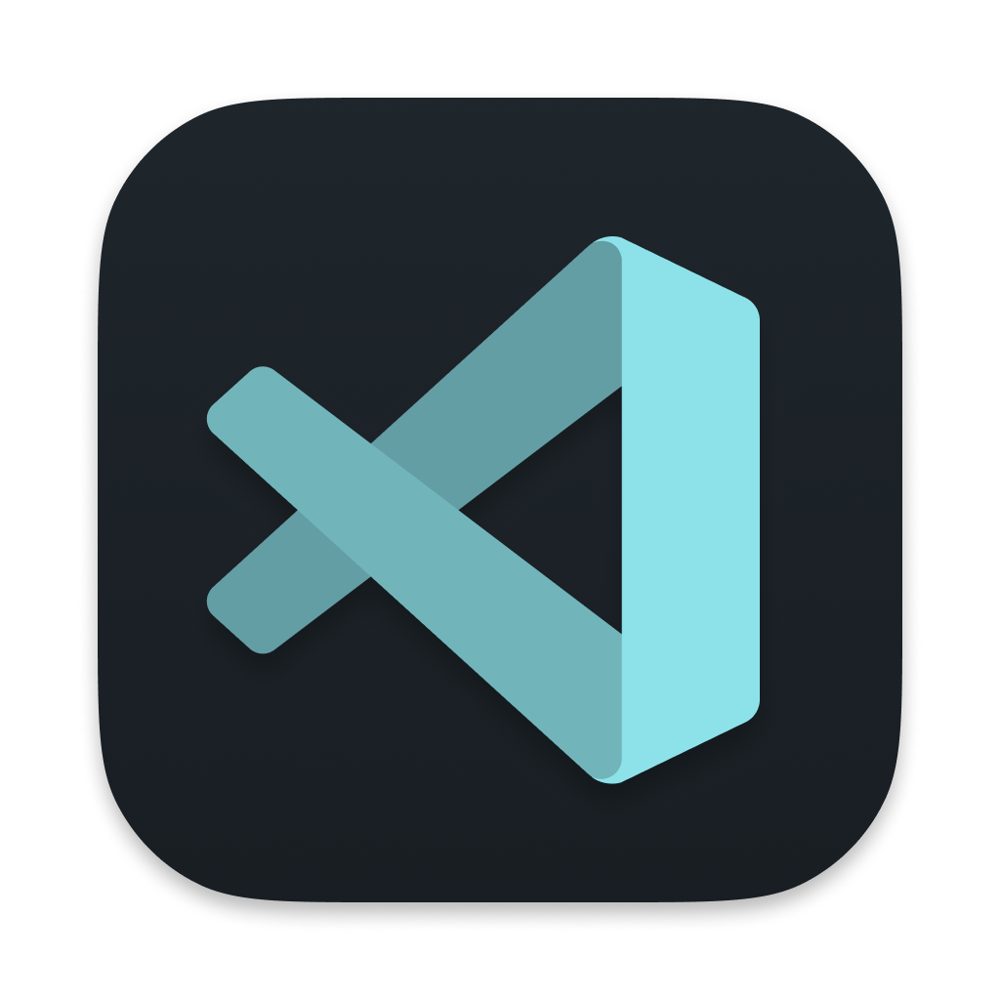
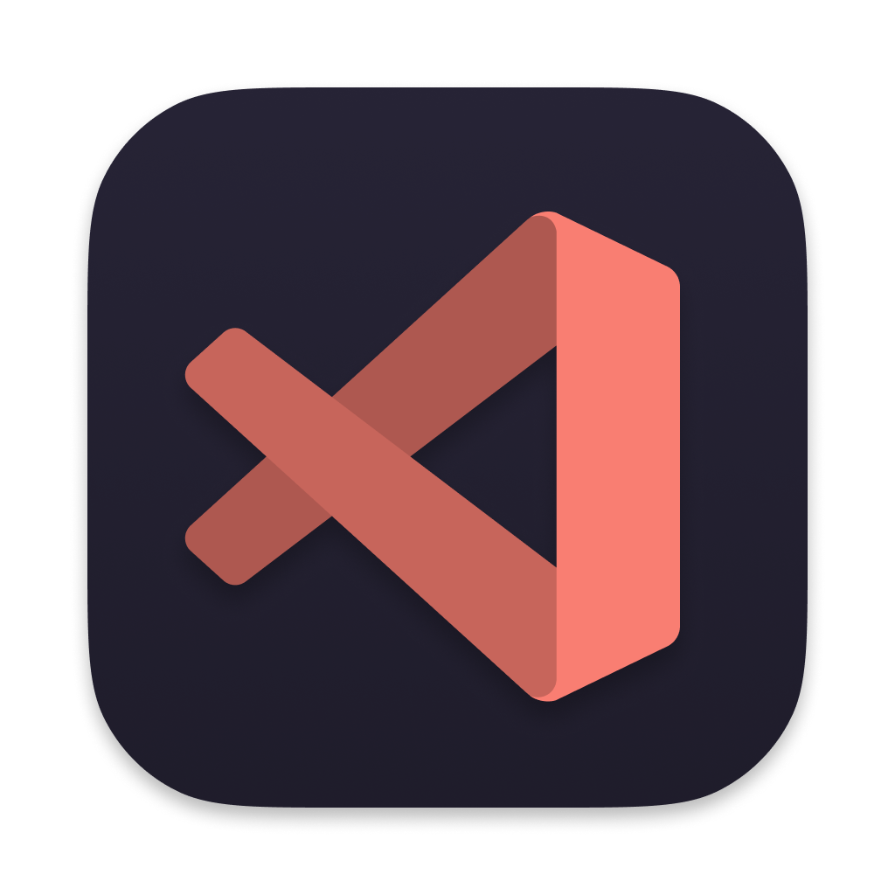
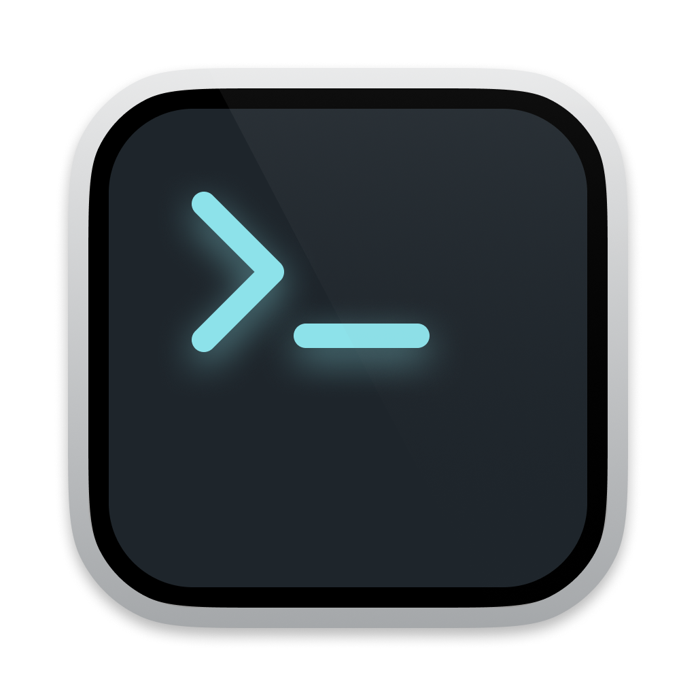
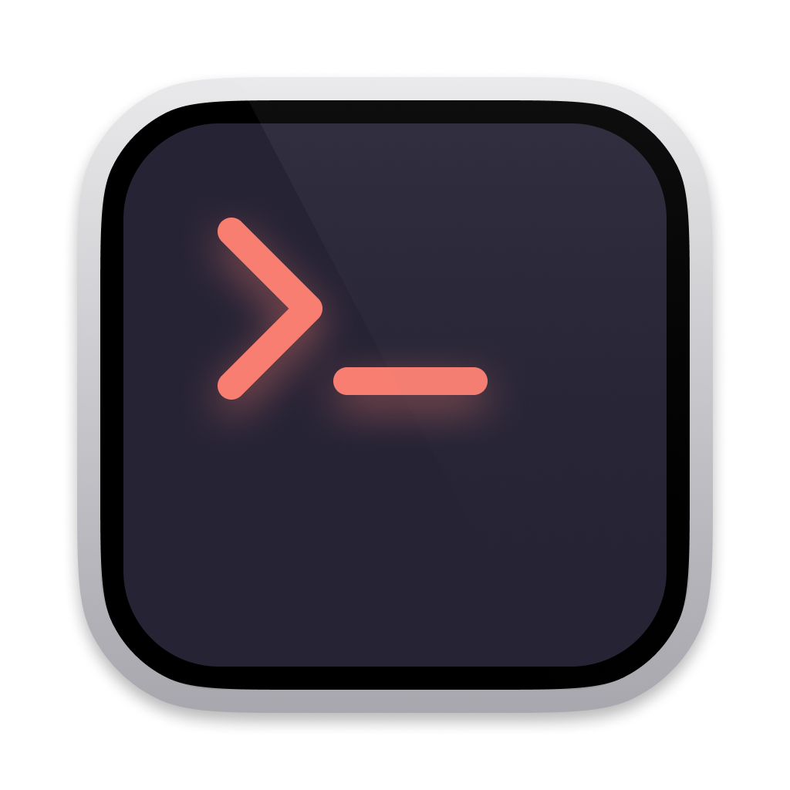
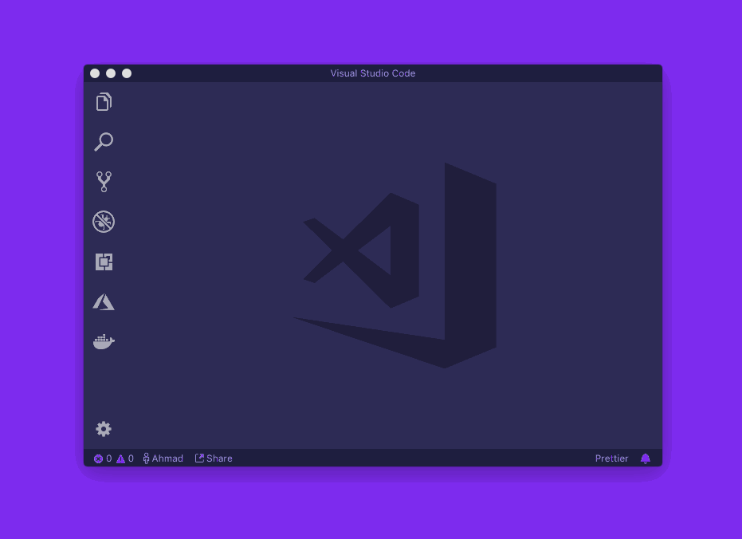

<!-- PROJECT LOGO -->
<p align="center">
  <h3 align="center">My Development Setup From Scratch</h3>
  <p align="center">
    I will show you about my devlopment setup, non development setup, configurations and cli tools.
    <br />
    <br />
  </p>
</p>

<!-- TABLE OF CONTENTS -->
<details open="open">
  <summary><h2 style="display: inline-block">Table of Contents</h2></summary>
  <ol>
    <li>
      <a href="#about-the-project">About The Project</a>
      <ul>
        <li><a href="#tools">Tools</a></li>
      </ul>
    </li>
    <li>
      <a href="#getting-started">Getting Started</a>
      <ul>
        <li><a href="#prerequisites">Prerequisites</a></li>
        <li><a href="#installation">Installation</a></li>
        <li><a href="#configuration">Configuration</a></li>
      </ul>
    </li>
    <li><a href="#usage">Usage</a></li>
    <li><a href="#license">License</a></li>
    <li><a href="#contact">Contact</a></li>
  </ol>
</details>

<!-- ABOUT THE PROJECT -->

## About The Project

This project is about to save my development setup workspace and config files and share to the others people to use setup the development environment in one repo.

### Tools

1. CLI tools
   - [Brew](https://brew.sh)
   - [OMZ](https://ohmyz.sh)
   - [Compoer](https://getcomposer.org)
   - [Cocoapod](https://cocoapods.org)
   - [Valet Plus](https://github.com/weprovide/valet-plus)
     - php
     - mysql
     - redis
     - mailhog
     - dnsmasq
     - nginx
     - xdebug
   - [Flutter](https://flutter.dev)
   - [Trash-cli](https://github.com/andreafrancia/trash-cli)
   - [MacVim](https://macvim-dev.github.io/macvim/)
2. Non Development Setup
   - [Alfred](https://www.alfredapp.com) Extra Features - $29 powerpack
   - [Spotify](https://www.spotify.com/us/download/mac/) $9.99/month
   - [1Password](https://1password.com) $2.99/month billed annually
   - [NordVPN](https://nordvpn.com) $11.95/month, $4.92/month 1 year, $3.3/month 2 years or $8.9/month
   - [VLC](https://www.videolan.org/vlc/download-macosx.html)
   - [Appcleaner](https://freemacsoft.net/appcleaner/)
   - [Rectangle](https://rectangleapp.com)
   - [Logi Options](https://www.logitech.com/en-us/product/options)
   - [AirDroid](https://www.airdroid.com)
   - [Telegram](https://telegram.org)
   - [Twitter](https://apps.apple.com/us/app/twitter/id1482454543?mt=12)
   - [Steam](https://steamcommunity.com)
   - [Zoom](https://zoom.us)
   - [TeamViewer](https://www.teamviewer.com/en-us/)
   - [The Unarchiver](https://theunarchiver.com)
3. Development Setup
   - [Fork](https://git-fork.com) $49.99 or free evaluation
   - [PhpStorm](https://www.jetbrains.com/phpstorm/) first year $89 second year $71 third year on wards $53 or $8.9/month
   - [IntelliJ IDEA](https://www.jetbrains.com/idea/) Ultimate - first year $149 second year $119 third year on wards $89 or $14.9/month
   - [IntelliJ IDEA](https://www.jetbrains.com/idea) Community - Free
   - [Android Studio](https://developer.android.com/studio)
   - [Xcode](https://developer.apple.com/xcode/)
   - [Sequel Ace](https://apps.apple.com/us/app/sequel-ace/id1518036000?mt=12)
   - [iTerm2](https://iterm2.com)
   - [Chrome](https://www.google.com/chrome/)
   - [Visual Studio Code](https://code.visualstudio.com)
4. [Setapp](https://setapp.com) $9.99/month or 8.99/month for annual to get following services
   - [TablePlus](https://tableplus.com) $69
   - [Paw](https://paw.cloud) $49.99
   - [Better Touch Tool](https://folivora.ai) like Rectangle - $8.5 for two years update and $20.5 for life time
   - [Bartender](https://www.macbartender.com) $15
5. Misc

   - [Fira Code](https://github.com/tonsky/FiraCode)
   - [vscode-icons](https://github.com/dhanishgajjar/vscode-icons)

      
      

   - [terminal-icons](https://github.com/dhanishgajjar/terminal-icons)

      
      

<!-- GETTING STARTED -->

## Getting Started

To get a local copy up and running follow these simple steps.

### Prerequisites

This is an example of how to list things you need to use the software and how to install them.

- Install Homebrew

  ```sh
  /bin/bash -c "$(curl -fsSL https://raw.githubusercontent.com/Homebrew/install/HEAD/install.sh)"
  ```

- Install OMZ

  ```sh
  # curl
  sh -c "$(curl -fsSL https://raw.githubusercontent.com/ohmyzsh/ohmyzsh/master/tools/install.sh)"

  # wget
  sh -c "$(wget -O- https://raw.githubusercontent.com/ohmyzsh/ohmyzsh/master/tools/install.sh)"

  # fetch
  sh -c "$(fetch -o - https://raw.githubusercontent.com/ohmyzsh/ohmyzsh/master/tools/install.sh)"
  ```

  _For more detail, [Github](https://github.com/ohmyzsh/ohmyzsh/) / [Website](https://ohmyz.sh)_

- Install zsh-syntax-highlighting

  ```sh
  git clone https://github.com/zsh-users/zsh-syntax-highlighting.git ${ZSH_CUSTOM:-~/.oh-my-zsh/custom}/plugins/zsh-syntax-highlighting
  ```

  _For more detail, [Github](https://github.com/zsh-users/zsh-syntax-highlighting)_

- Install Cocoapods

  ```sh
  brew install cocoapods
  ```

  _For more detail, [Cocoapods](https://cocoapods.org)_

### Installation

- Install Valet Plus

  Installation on M1 chip/Apple Sillicon

  ```sh
  brew install valet-php@7.2

  brew link --force valet-php@7.2

  composer global require weprovide/valet-plus

  cd ~/.composer/vendor/weprovide

  rm -rf valet-plus

  git clone https://github.com/Adam2Marsh/valet-plus

  cd ~/

  valet --brew-opt fix

  valet --brew-opt install
  ```

  Installation on intel

  ```sh
  brew install valet-php@7.2

  brew link --force valet-php@7.2

  composer global require weprovide/valet-plus

  valet fix

  valet install
  ```

- Install Flutter

  ```sh
  brew install --cask flutter
  ```

  _For more detail config, please go to the [Documentation](https://flutter.dev/docs/get-started/install/macos) and follow the steps_

- Install Visual Studio Code shell command `code` in PATH.

  

- Install Fira Code Font

  ```sh
  brew tap homebrew/cask-fonts
  brew install --cask font-fira-code
  ```

- Uninstall valet plus completely

  ```sh
  bash <(curl -s https://gist.githubusercontent.com/dannygsmith/5b74ba708d7bf8621c1cb6b959ece99f/raw/f1b0e88ba4e0a753b112bd2187c22bf8eaa9a234/valet-plus-destroy)
  ```

<!-- CONFIGURATION EXAMPLES -->

## Configuration

1. Zsh Config

   Add this code at the bottom of the .zshrc file.

   ```sh
   # OMZ plugin
   plugins=(git osx zsh-syntax-highlighting)

   # Misc
   alias zshconfig="vim ~/.zshrc"
   alias zshreload="source ~/.zshrc"
   alias hostfile="sudo vim /etc/hosts"
   alias publickey="pbcopy < ~/.ssh/id_rsa.pub"

   alias vimconfig="vim ~/.vimrc"

   alias o="open ."
   alias c="code ."

   # Path
   export PATH="/opt/homebrew/bin:$PATH" # M1/Apple Silicon
   # export PATH="$PATH:/usr/local/bin" # intel

   export PATH="$PATH:$HOME/.composer/vendor/bin"

   export PATH="$PATH:/Users/$(whoami)/flutter/bin"

   export ANDROID_HOME=/Users/$(whoami)/Library/Android/sdk
   export PATH="$PATH:$ANDROID_HOME/platform-tools"
   ```

2. Visual Studio Code Extensions

   - [advanced-new-file](https://marketplace.visualstudio.com/items?itemName=patbenatar.advanced-new-file)
   - [Auto Close Tag](https://marketplace.visualstudio.com/items?itemName=formulahendry.auto-close-tag)
   - [Auto Rename Tag](https://marketplace.visualstudio.com/items?itemName=formulahendry.auto-rename-tag)
   - [Beautify](https://marketplace.visualstudio.com/items?itemName=HookyQR.beautify)
   - [Bracket Pair Colorizer](https://marketplace.visualstudio.com/items?itemName=CoenraadS.bracket-pair-colorizer)
   - [City Lights Theme](ttps://marketplace.visualstudio.com/items?itemName=Yummygum.city-lights-theme)
   - [Dart](https://marketplace.visualstudio.com/items?itemName=Dart-Code.dart-code)
   - [DotENV](https://marketplace.visualstudio.com/items?itemName=mikestead.dotenv)
   - [File Utils](https://marketplace.visualstudio.com/items?itemName=sleistner.vscode-fileutils)
   - [Flutter](https://marketplace.visualstudio.com/items?itemName=Dart-Code.flutter)
   - [JQuery Code Snippets](https://marketplace.visualstudio.com/items?itemName=donjayamanne.jquerysnippets)
   - [Jupyter](https://marketplace.visualstudio.com/items?itemName=ms-toolsai.jupyter)
   - [Laravel Artisan](https://marketplace.visualstudio.com/items?itemName=ryannaddy.laravel-artisan)
   - [Laravel Blade Snippets](https://marketplace.visualstudio.com/items?itemName=onecentlin.laravel-blade)
   - [Laravel Extra Intellisense](https://marketplace.visualstudio.com/items?itemName=amiralizadeh9480.laravel-extra-intellisense)
   - [Laravel Goto Controller](https://marketplace.visualstudio.com/items?itemName=ctf0.laravel-goto-controller)
   - [Laravel Goto View](https://marketplace.visualstudio.com/items?itemName=ctf0.laravel-goto-view)
   - [Laravel Snippets](https://marketplace.visualstudio.com/items?itemName=onecentlin.laravel5-snippets)
   - [line-jumper](https://marketplace.visualstudio.com/items?itemName=alekseychaikovsky.line-jumper)
   - [Live Share](https://marketplace.visualstudio.com/items?itemName=MS-vsliveshare.vsliveshare)
   - [Livewire Language Support](https://marketplace.visualstudio.com/items?itemName=cierra.livewire-vscode)
   - [Material Icon Theme](https://marketplace.visualstudio.com/items?itemName=PKief.material-icon-theme)
   - [Path Intellisense](https://marketplace.visualstudio.com/items?itemName=christian-kohler.path-intellisense)
   - [PHP Constructor](https://marketplace.visualstudio.com/items?itemName=MehediDracula.php-constructor)
   - [PHP Debug](https://marketplace.visualstudio.com/items?itemName=felixfbecker.php-debug)
   - [PHP Intelephense](https://marketplace.visualstudio.com/items?itemName=bmewburn.vscode-intelephense-client)
   - [PHP Namespace Resolver](https://marketplace.visualstudio.com/items?itemName=MehediDracula.php-namespace-resolver)
   - [Polacode-2020](https://marketplace.visualstudio.com/items?itemName=jeff-hykin.polacode-2019)
   - [Prettier](https://marketplace.visualstudio.com/items?itemName=esbenp.prettier-vscode)
   - [Pubspec Assist](https://marketplace.visualstudio.com/items?itemName=jeroen-meijer.pubspec-assist)
   - [Pylance](https://marketplace.visualstudio.com/items?itemName=ms-python.vscode-pylance)
   - [Python](https://marketplace.visualstudio.com/items?itemName=ms-python.python)
   - [Quick and Simple Text Selection](https://marketplace.visualstudio.com/items?itemName=dbankier.vscode-quick-select)
   - [Settings Sync](https://marketplace.visualstudio.com/items?itemName=Shan.code-settings-sync)
   - [snippet-creator](https://marketplace.visualstudio.com/items?itemName=nikitaKunevich.snippet-creator)
   - [SVG Viewer](https://marketplace.visualstudio.com/items?itemName=cssho.vscode-svgviewer)
   - [Tailwind CSS IntelliSense](https://marketplace.visualstudio.com/items?itemName=bradlc.vscode-tailwindcss)
   - [Vim](https://marketplace.visualstudio.com/items?itemName=vscodevim.vim)
   - [vscode-faker](https://marketplace.visualstudio.com/items?itemName=deerawan.vscode-faker)
   - [Yii2 Snippets](https://marketplace.visualstudio.com/items?itemName=imanilchaudhari.yii2-snippets)

3. Vim Config

   First, git clone the [my development setup from scratch](https://github.com/Thuymm/my-development-setup-from-scratch).

   ```sh
   $ git clone https://github.com/Thuymm/my-development-setup-from-scratch.git ~/development-setup-from-scratch
   ```

   Move or copy the vim folder and vimrc file to home directory and rename it to `.vim` and `.vimrc`.

   ```sh
   cp -r development-setup-from-scratch/vim ~/.vim

   cp development-setup-from-scratch/vim/vimrc ~/.vimrc
   ```

4. iTerm2

   `Command + ,` to open preferences -> Keys -> Hotkey -> set Hotkey: I'm using **control + shift + `** as hotkey

   To set the color theme, Preferences -> Profiles -> Other Actions... in left pane to import JSON profiles. Choose Pro.json or Material.json files. Then set as default to the profile that you imported.

   Preferences -> Apperance -> General -> Theme: choose Minimal

<!-- USAGE EXAMPLES -->

## Usage

1. Valet Plus

   ```sh
   valet start

   valet stop

   valet restart

   valet park

   valet db list
   ```

   _For more detail, Valet Plus [Documentation](https://github.com/weprovide/valet-plus/wiki)_

<!-- LICENSE -->

## License

Distributed under the MIT License. See `LICENSE` for more information.

<!-- CONTACT -->

## Contact

Thuymm - [@thuymm6666](https://twitter.com/thuymm6666) - [email](mailto:thuyeinmoemyint@icloud.com)

Project Link: [My Development Setup From Scratch](https://github.com/Thuymm/my-development-setup-from-scratch)
